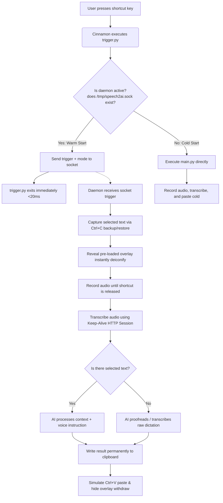

# speech2ai - AI-Powered Voice Dictation for Linux (Mint/Cinnamon)

**speech2ai** is an open-source, ultra-optimized voice dictation utility designed for Linux desktop environments (fully optimized for Linux Mint/Cinnamon and X11). It allows you to dictate text directly into any active input field (browsers, text editors, terminals) using global keyboard shortcuts.

The system supports both direct word-for-word transcription and advanced AI rewrite modes, such as grammar correction and structured prompt generation for AI coding agents (e.g., Cursor or Antigravity).

## 📊 System Flow & Architecture

Below is a flow diagram representing the warm-start socket client-daemon architecture and selection-aware pipeline:



---

## ⚡ Architectural Performance & Speed Optimizations

This application is built with a high-performance **Client-Daemon architecture** designed to minimize latency at every layer of the system:

1. **Persistent UNIX Socket Daemon (`tray.py`):** The system tray launcher runs as a background daemon, pre-loading heavy sound and UI libraries (like CustomTkinter, SoundDevice, PyStray) and active configurations in memory.
2. **Instant Hotkey Client Trigger (`trigger.py`):** Global shortcuts are registered to call a lightweight trigger client that communicates with the daemon via a UNIX socket (`/tmp/speech2ai.sock`) in under **20ms**. It includes a transparent fallback to cold-start `main.py` if the daemon is stopped.
3. **Preloaded Warm UI (`gui_overlay.py`):** The HUD visualizer window is instantiated and cached at startup in a hidden state (`withdraw`). On hotkey trigger, it repositions itself and displays instantly (`deiconify`), bypassing Tkinter window mapping overhead.
4. **HTTP Connection Pooling (`requests.Session`):** The daemon maintains a persistent HTTP connection pool with Keep-Alive to cloud providers (Gemini and Groq). This avoids the overhead of repeated TCP/TLS handshakes, cutting **150ms - 300ms** off every cloud API request.

---

## 🔍 Context-Aware Selection & Split Prompts

**speech2ai** includes an intelligent text-context parsing engine:

- **Highlight & Dictate:** Highlight text anywhere on screen (in web browsers, IDEs, or even read-only PDF viewers) and trigger dictation. The system securely captures the active selection (via a clipboard-safe copy-paste emulation) and bundles it with your spoken instructions.
- **Split Prompting:** The AI engine splits your prompt to separate the highlighted context and your verbal command (e.g. *"Omskriv til engelsk"* or *"Gør denne funktion asynkron"*). The LLM processes the instructions relative to that context.
- **Persistent Clipboard Fallback:** The final output is automatically copied to your system clipboard and remains there permanently. If you highlight text in a read-only viewer where direct insertion fails, the generated text is stored in your clipboard so you can paste it manually again and again.

---

## 🎨 Premium Obsidian Dark Settings GUI

The Settings panel has been redesigned with a premium dark mode inspired by modern productivity tools:

- **Obsidian Theme:** Implements a deep Obsidian palette (`#090D16`), structured card widgets, and high-contrast Indigo accents (`#6366F1`).
- **Dynamic Auto-Scrollbars (`AutoScrollableFrame`):** A custom frame layout that dynamically monitors content height and only displays scrollbars when settings content overflows the screen vertical bounds, maintaining a clean visual state.
- **Local Gemma Model Installer:** Download and configure local LLM models (e.g. `gemma:2b` or `gemma4:e4b`) directly from the GUI. It features a real-time progress monitor connecting to the Ollama HTTP stream API.

---

## ✨ Features

*   **Ultra-Fast HUD Overlay:** A floating iOS-style capsule at the bottom of the screen with a real-time flashing recording LED and a waveform volume visualizer.
*   **3 Smart Dictation Modes:**
    1.  **Direct Dictation:** Transcribes spoken audio exactly as heard without any AI edits.
    2.  **AI Dictation (Grammar):** Corrects grammar, spelling, and removes stutters or filler words (such as *uh, um, er*) while maintaining the language of the original text.
    3.  **AI Prompt (Coding Agent):** Translates spoken Danish/English description into a precise, action-oriented prompt tailored for AI coding agents.
*   **Built-in Localization (i18n):** Full support for **English**, **Danish**, and **Spanish**. The default language is English, and it can be changed directly from the settings GUI.
*   **Custom Vocabulary (Ordbog):** Map mispronounced or technical terms to correct spellings (e.g., *æpi* ➔ *API*, *git hub* ➔ *GitHub*).
*   **Automatic Mint/Cinnamon Integration:** Manage global keyboard shortcuts directly from the settings GUI, syncing programmatically with Linux Mint's `dconf` keybindings registry.

---

## 🛠️ Installation

Set up **speech2ai** by running the automated installation script:

1.  Open your terminal in the cloned directory.
2.  Execute the installer:
    ```bash
    chmod +x install.sh
    ./install.sh
    ```
    *The installer checks for system packages (`xclip`, `xdotool`, `portaudio`, etc.) and offers to install them automatically.*
3.  Restart your session (log out and back in) to activate the autostart and shortcut registry.

---

## ⚙️ Keyboard Shortcuts

After installation, search for **Speech2AI Settings** in your start menu to enter your API keys and configure shortcuts.

The application binds the following shortcuts by default:
*   **Direct Dictation:** `Super + Y`
    *   *Transcribes words directly to the cursor.*
*   **AI Dictation (Grammar):** `Super + Shift + Y`
    *   *Cleans grammatical filler words or translates/proofreads highlighted selections.*
*   **AI Prompt (Coding):** `Super + Ctrl + Y`
    *   *Generates structured programming prompts from your instructions and selected code.*

You can change these in the settings interface, and the program will automatically update them in Linux Mint.

---

## ⚖️ License

Distributed under the MIT License. See [LICENSE](LICENSE) for more information.
