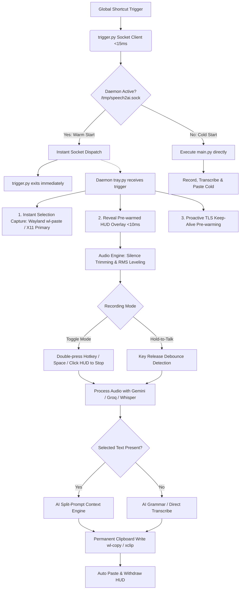

# speech2ai - Next-Gen AI Voice Dictation for Linux (Wayland & X11)

**speech2ai** is an open-source, ultra-optimized, future-proof voice dictation engine and AI coding companion for Linux desktop environments (fully compatible with **Wayland**—GNOME, KDE, Cinnamon Wayland, Hyprland, Sway—and **X11**). It allows you to dictate text directly into any active window or code editor using global keyboard shortcuts.

The system supports word-for-word dictation, intelligent grammar correction, and structured prompt generation for AI coding agents (such as Cursor or Antigravity).

---

## 📊 System Architecture & Flow


```mermaid
graph TD
    A[Global Shortcut Trigger] --> B(trigger.py Socket Client <15ms)
    B --> C{Daemon Active?<br>/tmp/speech2ai.sock}
    
    %% Warm Start Flow
    C -- Yes: Warm Start --> D[Instant Socket Dispatch]
    D --> E[trigger.py exits immediately]
    
    %% Cold Start Fallback
    C -- No: Cold Start --> F[Execute main.py directly]
    F --> G[Record, Transcribe & Paste Cold]
    
    %% Daemon Execution
    D -.-> H[Daemon tray.py receives trigger]
    H --> I[1. Instant Selection Capture: Wayland wl-paste / X11 Primary]
    H --> J[2. Reveal Pre-warmed HUD Overlay <10ms]
    H --> K[3. Proactive TLS Keep-Alive Pre-warming]
    
    J --> L[Audio Engine: Silence Trimming & RMS Leveling]
    L --> M{Recording Mode}
    M -- Toggle Mode --> N[Double-press Hotkey / Space / Click HUD to Stop]
    M -- Hold-to-Talk --> O[Key Release Debounce Detection]
    
    N --> P[Process Audio with Gemini / Groq / Whisper]
    O --> P
    
    P --> Q{Selected Text Present?}
    Q -- Yes --> R[AI Split-Prompt Context Engine]
    Q -- No --> S[AI Grammar / Direct Transcribe]
    
    R --> T[Permanent Clipboard Write wl-copy / xclip]
    S --> T
    T --> U[Auto Paste & Withdraw HUD]
```

---

## ⚡ Next-Gen Performance & Future-Proof Standards

This application is built with a high-performance **Client-Daemon architecture** designed for zero latency:

1. **Wayland & X11 Dual Compatibility (`system_compat.py`):** Unified display server abstraction layer supporting modern Wayland tools (`wl-clipboard`, `wtype`, `ydotool`) and classic X11 with native zero-sleep primary selection extraction.
2. **Dual Recording Modes:**
   - **Toggle Mode (Default & Wayland Standard):** Press hotkey to start recording, press hotkey again (or click overlay / press Space) to finish and transcribe.
   - **Hold-to-Talk Mode (Push-to-Talk):** Press and hold the shortcut, speak, and release to instantly insert text.
3. **Zero-Idle-Latency TLS Pre-Warming:** Proactively warms up the HTTPS/TLS 1.3 connection to Google Gemini or Groq *in parallel while you are speaking*. When you stop speaking, the socket is already warm, eliminating idle connection wake-up latency.
4. **Intelligent Silence Trimming:** Automatically analyzes voice energy (RMS) with NumPy to trim leading and trailing background silence before uploading, reducing audio payload size and accelerating transcription.
5. **Persistent UNIX Socket Daemon (`tray.py`):** The system tray launcher runs as a lightweight daemon, pre-loading heavy audio and UI libraries in memory with clean `SIGTERM`/`SIGINT` lifecycle cleanup.

---

## 🔍 Context-Aware Selection & Split Prompts

**speech2ai** includes an intelligent text-context parsing engine:

- **Highlight & Dictate:** Highlight text anywhere on screen (in web browsers, IDEs, or read-only PDF viewers) and trigger dictation. The system captures the active selection instantly (in under 5ms) and bundles it with your spoken instructions.
- **Split Prompting:** The AI engine splits your prompt to separate the highlighted context and your verbal command (e.g. *"Omskriv til engelsk"* or *"Gør denne funktion asynkron"*). The LLM processes the instructions relative to that context.
- **Permanent Clipboard Fallback:** The final output is automatically copied to your system clipboard and remains there permanently. If you highlight text in a read-only viewer, the generated text is stored in your clipboard so you can paste it manually anytime.

---

## 🎨 Obsidian Dark Settings GUI

The Settings panel includes:

- **Obsidian Theme:** Implements a deep Obsidian palette (`#090D16`), structured card widgets, and high-contrast Indigo accents (`#6366F1`).
- **Microphone Input Selector:** Dynamically queries available audio input devices and allows configuring dedicated microphones.
- **Recording Mode Configuration:** Easily switch between *Automatic*, *Toggle*, and *Hold-to-Talk*.
- **Local Gemma Model Installer:** Download and configure local LLM models (e.g. `gemma4:e4b`) directly from the GUI with live download progress.

---

## ✨ Features

*   **Ultra-Fast HUD Overlay:** A floating iOS-style capsule at the bottom of the screen with a real-time flashing recording LED and a waveform volume visualizer.
*   **3 Smart Dictation Modes:**
    1.  **Direct Dictation:** Transcribes spoken audio exactly as heard without any AI edits.
    2.  **AI Dictation (Grammar):** Corrects grammar, spelling, and removes stutters or filler words (such as *uh, um, er*) while maintaining the language of the original text.
    3.  **AI Prompt (Coding Agent):** Translates spoken Danish/English description into a precise, action-oriented prompt tailored for AI coding agents.
*   **Built-in Localization (i18n):** Full support for **English**, **Danish**, and **Spanish**.
*   **Custom Vocabulary (Ordbog):** Map mispronounced or technical terms to correct spellings (e.g., *æpi* ➔ *API*, *git hub* ➔ *GitHub*).
*   **Automatic Mint/Cinnamon Integration:** Manage global keyboard shortcuts directly from the settings GUI, syncing programmatically with Linux Mint's `dconf` keybindings registry.

---

## 🛠️ Installation

Set up **speech2ai** by running the automated installation script:

1.  Open your terminal in the cloned directory.
2.  Execute the installer:
    ```bash
    chmod +x install.sh
    ./install.sh
    ```
3.  Restart your session (log out and back in) to activate the autostart and shortcut registry.
